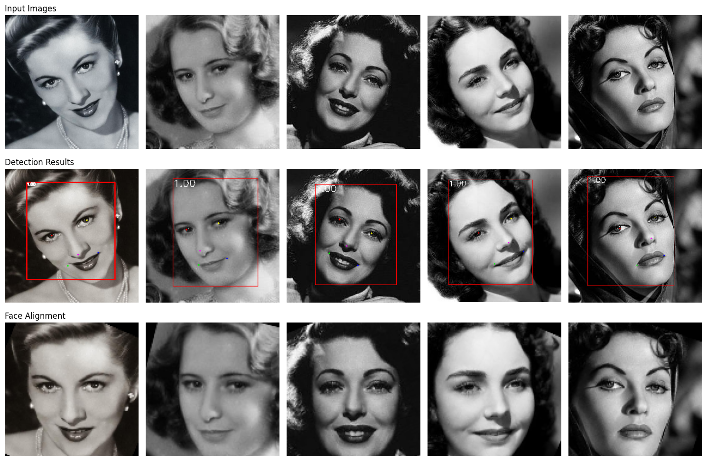

# UniFace: All-in-One Face Analysis Library

[](https://opensource.org/licenses/MIT)

[](https://pypi.org/project/uniface/)
[](https://github.com/yakhyo/uniface/actions)
[](https://github.com/yakhyo/uniface)
[](https://pepy.tech/project/uniface)
[](https://www.python.org/dev/peps/pep-0008/)
[](https://github.com/yakhyo/uniface/releases)

**uniface** is a lightweight face detection library designed for high-performance face localization, landmark detection and face alignment. The library supports ONNX models and provides utilities for bounding box visualization and landmark plotting. To train RetinaFace model, see https://github.com/yakhyo/retinaface-pytorch.

---

## Features

| Date       | Feature Description                                                                                             |
| ---------- | --------------------------------------------------------------------------------------------------------------- |
| Planned    | 🎭 **Age and Gender Detection**: Planned feature for predicting age and gender from facial images.              |
| Planned    | 🧩 **Face Recognition**: Upcoming capability to identify and verify faces.                                      |
| 2024-11-21 | 🔄 **Face Alignment**: Added precise face alignment for better downstream tasks.                                |
| 2024-11-20 | ⚡ **High-Speed Face Detection**: ONNX model integration for faster and efficient face detection.               |
| 2024-11-20 | 🎯 **Facial Landmark Localization**: Accurate detection of key facial features like eyes, nose, and mouth.      |
| 2024-11-20 | 🛠 **API for Inference and Visualization**: Simplified API for seamless inference and visual results generation. |

---

## Installation

The easiest way to install **UniFace** is via [PyPI](https://pypi.org/project/uniface/). This will automatically install the library along with its prerequisites.

```bash
pip install uniface
```

To work with the latest version of **UniFace**, which may not yet be released on PyPI, you can install it directly from the repository:

```bash
git clone https://github.com/yakhyo/uniface.git
cd uniface
pip install .
```

---

## Quick Start

To get started with face detection using **UniFace**, check out the [example notebook](examples/face_detection.ipynb).
It demonstrates how to initialize the model, run inference, and visualize the results.

---

## Examples

<div align="center">
    
</div>

Explore the following example notebooks to learn how to use **UniFace** effectively:

- [Face Detection](examples/face_detection.ipynb): Demonstrates how to perform face detection, draw bounding boxes, and landmarks on an image.
- [Face Alignment](examples/face_alignment.ipynb): Shows how to align faces using detected landmarks.
- [Age and Gender Detection](examples/age_gender.ipynb): Example for detecting age and gender from faces. (underdevelopment)

### Initialize the Model

```python
from uniface import RetinaFace

# Initialize the RetinaFace model
uniface_inference = RetinaFace(
    model="retinaface_mnet_v2",  # Model name
    conf_thresh=0.5,             # Confidence threshold
    pre_nms_topk=5000,           # Pre-NMS Top-K detections
    nms_thresh=0.4,              # NMS IoU threshold
    post_nms_topk=750,           # Post-NMS Top-K detections
    dynamic_size=False,          # Arbitrary image size inference
    input_size=(640, 640)        # Pre-defined input image size
)
```

### Run Inference

Inference on image:

```python
import cv2
from uniface.visualization import draw_detections

# Load an image
image_path = "assets/test.jpg"
original_image = cv2.imread(image_path)

# Perform inference
boxes, landmarks = uniface_inference.detect(original_image)

# Visualize results
draw_detections(original_image, (boxes, landmarks), vis_threshold=0.6)

# Save the output image
output_path = "output.jpg"
cv2.imwrite(output_path, original_image)
print(f"Saved output image to {output_path}")
```

Inference on video:

```python
import cv2
from uniface.visualization import draw_detections

# Initialize the webcam
cap = cv2.VideoCapture(0)

if not cap.isOpened():
    print("Error: Unable to access the webcam.")
    exit()

while True:
    # Capture a frame from the webcam
    ret, frame = cap.read()
    if not ret:
        print("Error: Failed to read frame.")
        break

    # Perform inference
    boxes, landmarks = uniface_inference.detect(frame)

    # Draw detections on the frame
    draw_detections(frame, (boxes, landmarks), vis_threshold=0.6)

    # Display the output
    cv2.imshow("Webcam Inference", frame)

    # Exit if 'q' is pressed
    if cv2.waitKey(1) & 0xFF == ord('q'):
        break

# Release the webcam and close all OpenCV windows
cap.release()
cv2.destroyAllWindows()
```

---

### Evaluation results of available models on WiderFace

| RetinaFace Models  | Easy       | Medium     | Hard       |
| ------------------ | ---------- | ---------- | ---------- |
| retinaface_mnet025 | 88.48%     | 87.02%     | 80.61%     |
| retinaface_mnet050 | 89.42%     | 87.97%     | 82.40%     |
| retinaface_mnet_v1 | 90.59%     | 89.14%     | 84.13%     |
| retinaface_mnet_v2 | 91.70%     | 91.03%     | 86.60%     |
| retinaface_r18     | 92.50%     | 91.02%     | 86.63%     |
| retinaface_r34     | **94.16%** | **93.12%** | **88.90%** |

<div align="center">
    
</div>

## API Reference

### `RetinaFace` Class

#### Initialization

```python
from typings import Tuple

RetinaFace(
    model: str,
    conf_thresh: float = 0.5,
    pre_nms_topk: int = 5000,
    nms_thresh: float = 0.4,
    post_nms_topk: int = 750,
    dynamic_size: bool = False,
    input_size: Tuple[int, int] = (640, 640)
)
```

**Parameters**:

- `model` _(str)_: Name of the model to use. Supported models:
  - `retinaface_mnet025`, `retinaface_mnet050`, `retinaface_mnet_v1`, `retinaface_mnet_v2`
  - `retinaface_r18`, `retinaface_r34`
- `conf_thresh` _(float, default=0.5)_: Minimum confidence score for detections.
- `pre_nms_topk` _(int, default=5000)_: Max detections to keep before NMS.
- `nms_thresh` _(float, default=0.4)_: IoU threshold for Non-Maximum Suppression.
- `post_nms_topk` _(int, default=750)_: Max detections to keep after NMS.
- `dynamic_size` _(Optional[bool], default=False)_: Use dynamic input size.
- `input_size` _(Optional[Tuple[int, int]], default=(640, 640))_: Static input size for the model (width, height).

---

### `detect` Method

```python
detect(
    image: np.ndarray,
    max_num: int = 0,
    metric: str = "default",
    center_weight: float = 2.0
) -> Tuple[np.ndarray, np.ndarray]
```

**Description**:
Detects faces in the given image and returns bounding boxes and landmarks.

**Parameters**:

- `image` _(np.ndarray)_: Input image in BGR format.
- `max_num` _(int, default=0)_: Maximum number of faces to return. `0` means return all.
- `metric` _(str, default="default")_: Metric for prioritizing detections:
  - `"default"`: Prioritize detections closer to the image center.
  - `"max"`: Prioritize larger bounding box areas.
- `center_weight` _(float, default=2.0)_: Weight for prioritizing center-aligned faces.

**Returns**:

- `bounding_boxes` _(np.ndarray)_: Array of detections as `[x_min, y_min, x_max, y_max, confidence]`.
- `landmarks` _(np.ndarray)_: Array of landmarks as `[(x1, y1), ..., (x5, y5)]`.

---

### Visualization Utilities

#### `draw_detections`

```python
draw_detections(
    image: np.ndarray,
    detections: Tuple[np.ndarray, np.ndarray],
    vis_threshold: float = 0.6
) -> None
```

**Description**:
Draws bounding boxes and landmarks on the given image.

**Parameters**:

- `image` _(np.ndarray)_: The input image in BGR format.
- `detections` _(Tuple[np.ndarray, np.ndarray])_: A tuple of bounding boxes and landmarks.
- `vis_threshold` _(float, default=0.6)_: Minimum confidence score for visualization.

---

## Contributing

We welcome contributions to enhance the library! Feel free to:

- Submit bug reports or feature requests.
- Fork the repository and create a pull request.

---

## License

This project is licensed under the MIT License. See the [LICENSE](LICENSE) file for details.

---

## Acknowledgments

- Based on the RetinaFace model for face detection ([https://github.com/yakhyo/retinaface-pytorch](https://github.com/yakhyo/retinaface-pytorch)).
- Inspired by InsightFace and other face detection projects.

---
