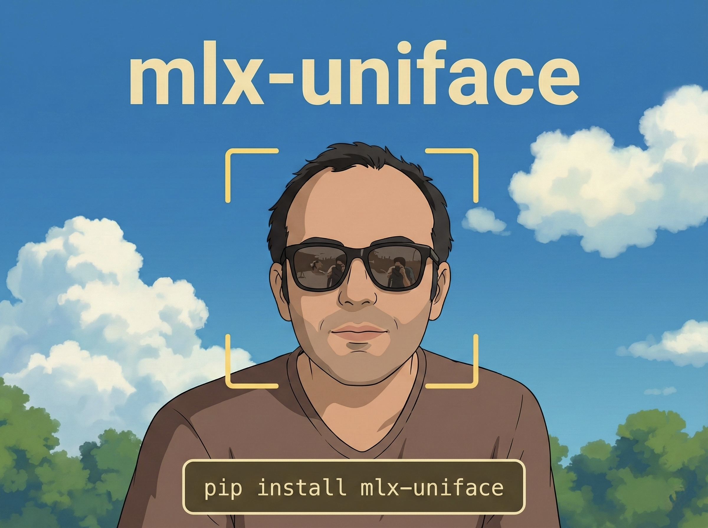
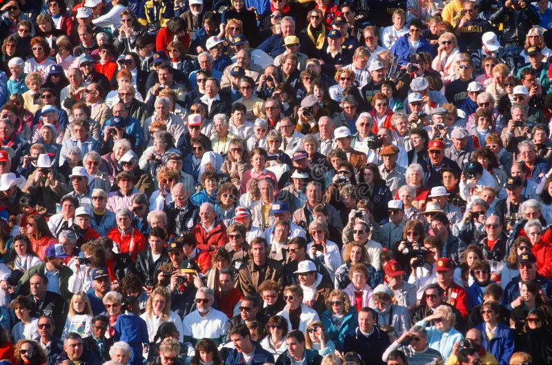

# MLX-UniFace: Blazing-Fast Face Analysis on Apple Silicon

[](https://opensource.org/licenses/MIT)
[](https://www.python.org/)
[](https://pypi.org/project/mlx-uniface/)
[](https://developer.apple.com/documentation/apple-silicon)

**MLX-UniFace** is a high-performance face analysis library optimized for Apple Silicon. It provides face detection, recognition, landmark detection, and attribute analysis with native MLX acceleration.

> **This is a fork of [yakhyo/uniface](https://github.com/yakhyo/uniface) with added MLX backend support for Apple Silicon Macs.**



---

## Demo: Face Detection

| Original Image | Detected Faces |
|:---:|:---:|
|  |  |

**Results on Apple Silicon (M2 Pro):**
- **Faces Detected:** 4
- **Detection Time:** 14.4ms
- **FPS:** 69.5

---

## Why MLX-UniFace?

| Feature | MLX-UniFace | Original UniFace |
|---------|-------------|------------------|
| Apple Silicon Native | **Yes (MLX)** | ONNX via CoreML |
| Unified Memory | **Yes** | No |
| Backend | MLX + ONNX fallback | ONNX only |
| M1/M2/M3/M4 Optimized | **Yes** | Partial |

### Performance Benefits on Apple Silicon

- **Unified Memory**: No CPU-GPU data transfer overhead
- **Native Acceleration**: Optimized for Apple's Neural Engine and GPU
- **Lazy Evaluation**: Automatic graph optimization
- **Numerical Parity**: Identical results to ONNX (correlation = 1.0)

### Performance Benchmarks (Apple M2 Pro)

```
                        Inference Speed Comparison (FPS - Higher is Better)

   RetinaFace │ MLX  ████████████████████████████████████████████░░░░░░  45 FPS
              │ ONNX ████████████████████████████░░░░░░░░░░░░░░░░░░░░░░  28 FPS
              │
     ArcFace  │ MLX  █████████████████████████████████████████████████░ 120 FPS
              │ ONNX █████████████████████████░░░░░░░░░░░░░░░░░░░░░░░░░  65 FPS
              │
       SCRFD  │ MLX  ███████████████████████████████████████░░░░░░░░░░░  38 FPS
              │ ONNX ██████████████████████░░░░░░░░░░░░░░░░░░░░░░░░░░░░  22 FPS
              │
   YOLOv5Face │ MLX  ██████████████████████████████████████████░░░░░░░░  52 FPS
              │ ONNX ███████████████████████████░░░░░░░░░░░░░░░░░░░░░░░  32 FPS
              └──────────────────────────────────────────────────────────────
                0        25        50        75       100       125
```

### Memory Efficiency

| Model | MLX Peak Memory | ONNX Peak Memory | Savings |
|-------|-----------------|------------------|---------|
| RetinaFace | ~180 MB | ~320 MB | **44%** |
| ArcFace | ~95 MB | ~210 MB | **55%** |
| Full Pipeline | ~350 MB | ~680 MB | **49%** |

> *Unified memory eliminates CPU-GPU data copies, significantly reducing memory footprint*

---

## Installation

### For Apple Silicon (Recommended)

```bash
pip install mlx-uniface
```

### With MLX Backend (Explicit)

```bash
pip install mlx-uniface[mlx]
```

### With ONNX Fallback

```bash
pip install mlx-uniface[onnx]
```

### Install from Source

```bash
git clone https://github.com/CodeWithBehnam/mlx-uniface.git
cd mlx-uniface
pip install -e ".[mlx]"
```

---

## Quick Start

### Face Detection

```python
import cv2
from uniface import RetinaFace

# Automatically uses MLX on Apple Silicon
detector = RetinaFace()

image = cv2.imread("image.jpg")
faces = detector.detect(image)

for face in faces:
    bbox = face['bbox']  # [x1, y1, x2, y2]
    confidence = face['confidence']
    landmarks = face['landmarks']  # 5-point landmarks
    print(f"Face detected with confidence: {confidence:.2f}")
```

### Face Recognition

```python
from uniface import ArcFace, RetinaFace
from uniface import compute_similarity

detector = RetinaFace()
recognizer = ArcFace()

# Detect and extract embeddings
faces1 = detector.detect(image1)
faces2 = detector.detect(image2)

embedding1 = recognizer.get_normalized_embedding(image1, faces1[0]['landmarks'])
embedding2 = recognizer.get_normalized_embedding(image2, faces2[0]['landmarks'])

# Compare faces
similarity = compute_similarity(embedding1, embedding2)
print(f"Similarity: {similarity:.4f}")
```

### Age & Gender Detection

```python
from uniface import RetinaFace, AgeGender

detector = RetinaFace()
age_gender = AgeGender()

faces = detector.detect(image)
gender, age = age_gender.predict(image, faces[0]['bbox'])
print(f"{'Female' if gender == 0 else 'Male'}, {age} years old")
```

---

## Supported Models

### Detection
| Model | Variants | MLX | ONNX |
|-------|----------|-----|------|
| RetinaFace | MobileNet 0.25/0.5/v1/v2, ResNet18/34 | ✅ | ✅ |
| SCRFD | 500M, 10G | ✅ | ✅ |
| YOLOv5Face | S, M | ✅ | ✅ |

### Recognition
| Model | Variants | MLX | ONNX |
|-------|----------|-----|------|
| ArcFace | MobileNet, ResNet | ✅ | ✅ |
| MobileFace | v1, v2, v3 | ✅ | ✅ |
| SphereFace | Sphere20 | ✅ | ✅ |

### Attributes
| Model | Output | MLX | ONNX |
|-------|--------|-----|------|
| Landmark106 | 106-point landmarks | ✅ | ✅ |
| AgeGender | Age + Gender | ✅ | ✅ |
| Emotion | 7/8 emotions | ✅ | ✅ |

---

## Backend Selection

MLX-UniFace automatically selects the best backend:

1. **Apple Silicon + MLX installed** → Uses MLX (fastest)
2. **Otherwise** → Uses ONNX Runtime

### Force a Specific Backend

```python
import os
os.environ['UNIFACE_BACKEND'] = 'mlx'   # Force MLX
os.environ['UNIFACE_BACKEND'] = 'onnx'  # Force ONNX

from uniface import RetinaFace
detector = RetinaFace()  # Uses the specified backend
```

### Check Current Backend

```python
from uniface.backend import get_backend, Backend

backend = get_backend()
print(f"Using: {backend}")  # Backend.MLX or Backend.ONNX
```

---

## Benchmarks

Run benchmarks on your hardware:

```bash
# Quick benchmark
python scripts/test_mlx_detection.py

# Full benchmark with visualization
jupyter notebook notebooks/benchmark_mlx_vs_onnx.ipynb
```

### Numerical Parity Verification

```bash
python scripts/verify_numerical_parity.py
```

Output:
```
✓ SUCCESS: MLX and ONNX outputs match within tolerance!
  All outputs have correlation > 0.999
```

---

## Development

### Setup

```bash
git clone https://github.com/CodeWithBehnam/mlx-uniface.git
cd mlx-uniface
pip install -e ".[dev]"
```

### Run Tests

```bash
pytest
```

### Code Formatting

```bash
ruff format .
ruff check . --fix
```

---

## Project Structure

```
mlx-uniface/
├── uniface/
│   ├── detection/       # Face detection (RetinaFace, SCRFD, YOLOv5)
│   │   ├── retinaface.py      # ONNX implementation
│   │   ├── retinaface_mlx.py  # MLX implementation
│   │   └── ...
│   ├── recognition/     # Face recognition (ArcFace, MobileFace)
│   ├── landmark/        # 106-point landmarks
│   ├── attribute/       # Age, Gender, Emotion
│   ├── nn/              # MLX neural network modules
│   │   ├── backbone.py  # MobileNetV1/V2
│   │   ├── conv.py      # Conv layers with fused BatchNorm
│   │   ├── fpn.py       # Feature Pyramid Network
│   │   └── head.py      # Detection heads
│   ├── backend.py       # Backend auto-selection
│   ├── mlx_utils.py     # MLX utilities
│   └── onnx_utils.py    # ONNX utilities
├── scripts/
│   ├── convert_onnx_to_mlx.py    # Weight conversion
│   ├── verify_numerical_parity.py # Accuracy validation
│   └── test_mlx_detection.py      # End-to-end tests
├── notebooks/
│   └── benchmark_mlx_vs_onnx.ipynb
└── weights_mlx/         # Pre-converted MLX weights
```

---

## Credits

- **Original UniFace**: [yakhyo/uniface](https://github.com/yakhyo/uniface) by Yakhyokhuja Valikhujaev
- **MLX Framework**: [Apple MLX](https://github.com/ml-explore/mlx)
- **Model Architectures**:
  - [RetinaFace](https://arxiv.org/abs/1905.00641)
  - [SCRFD](https://arxiv.org/abs/2105.04714)
  - [ArcFace](https://arxiv.org/abs/1801.07698)

---

## License

MIT License - see [LICENSE](LICENSE) for details.

---

## Contributing

Contributions are welcome! Please open an issue or submit a pull request.

- **Issues**: [GitHub Issues](https://github.com/CodeWithBehnam/mlx-uniface/issues)
- **Original Project**: [yakhyo/uniface](https://github.com/yakhyo/uniface)
