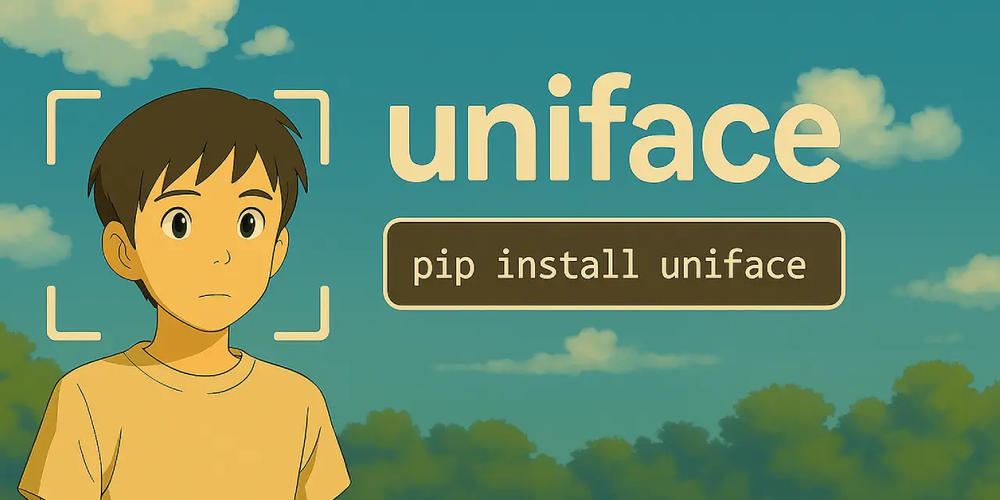

# UniFace: All-in-One Face Analysis Library

<div align="center">

[](https://opensource.org/licenses/MIT)
[](https://www.python.org/)
[](https://pypi.org/project/uniface/)
[](https://github.com/yakhyo/uniface/actions)
[](https://pepy.tech/project/uniface)
[](https://deepwiki.com/yakhyo/uniface)

</div>

<div align="center">
    
</div>

**UniFace** is a lightweight, production-ready face analysis library built on ONNX Runtime. It provides high-performance face detection, recognition, landmark detection, face parsing, gaze estimation, and attribute analysis with hardware acceleration support across platforms.

---

## Features

- **High-Speed Face Detection**: ONNX-optimized RetinaFace, SCRFD, and YOLOv5-Face models
- **Facial Landmark Detection**: Accurate 106-point landmark localization
- **Face Recognition**: ArcFace, MobileFace, and SphereFace embeddings
- **Face Parsing**: BiSeNet-based semantic segmentation with 19 facial component classes
- **Gaze Estimation**: Real-time gaze direction prediction with MobileGaze
- **Attribute Analysis**: Age, gender, race (FairFace), and emotion detection
- **Anti-Spoofing**: Face liveness detection with MiniFASNet models
- **Face Anonymization**: Privacy-preserving face blurring with 5 methods (pixelate, gaussian, blackout, elliptical, median)
- **Face Alignment**: Precise alignment for downstream tasks
- **Hardware Acceleration**: ARM64 optimizations (Apple Silicon), CUDA (NVIDIA), CPU fallback
- **Simple API**: Intuitive factory functions and clean interfaces
- **Production-Ready**: Type hints, comprehensive logging, PEP8 compliant

---

## Installation

### Quick Install (All Platforms)

```bash
pip install uniface
```

### Platform-Specific Installation

#### macOS (Apple Silicon - M1/M2/M3/M4)

For Apple Silicon Macs, the standard installation automatically includes optimized ARM64 support:

```bash
pip install uniface
```

The base `onnxruntime` package (included with uniface) has native Apple Silicon support with ARM64 optimizations built-in since version 1.13+.

#### Linux/Windows with NVIDIA GPU

For CUDA acceleration on NVIDIA GPUs:

```bash
pip install uniface[gpu]
```

**Requirements:**

- CUDA 11.x or 12.x
- cuDNN 8.x
- See [ONNX Runtime GPU requirements](https://onnxruntime.ai/docs/execution-providers/CUDA-ExecutionProvider.html)

#### CPU-Only (All Platforms)

```bash
pip install uniface
```

### Install from Source

```bash
git clone https://github.com/yakhyo/uniface.git
cd uniface
pip install -e .
```

---

## Quick Start

### Face Detection

```python
import cv2
from uniface import RetinaFace

# Initialize detector
detector = RetinaFace()

# Load image
image = cv2.imread("image.jpg")

# Detect faces
faces = detector.detect(image)

# Process results
for face in faces:
    bbox = face.bbox  # np.ndarray [x1, y1, x2, y2]
    confidence = face.confidence
    landmarks = face.landmarks  # np.ndarray (5, 2) landmarks
    print(f"Face detected with confidence: {confidence:.2f}")
```

### Face Recognition

```python
from uniface import ArcFace, RetinaFace
from uniface import compute_similarity

# Initialize models
detector = RetinaFace()
recognizer = ArcFace()

# Detect and extract embeddings
faces1 = detector.detect(image1)
faces2 = detector.detect(image2)

embedding1 = recognizer.get_normalized_embedding(image1, faces1[0].landmarks)
embedding2 = recognizer.get_normalized_embedding(image2, faces2[0].landmarks)

# Compare faces
similarity = compute_similarity(embedding1, embedding2)
print(f"Similarity: {similarity:.4f}")
```

### Facial Landmarks

```python
from uniface import RetinaFace, Landmark106

detector = RetinaFace()
landmarker = Landmark106()

faces = detector.detect(image)
landmarks = landmarker.get_landmarks(image, faces[0].bbox)
# Returns 106 (x, y) landmark points
```

### Age & Gender Detection

```python
from uniface import RetinaFace, AgeGender

detector = RetinaFace()
age_gender = AgeGender()

faces = detector.detect(image)
result = age_gender.predict(image, faces[0].bbox)
print(f"{result.sex}, {result.age} years old")
# result.gender: 0=Female, 1=Male
# result.sex: "Female" or "Male"
# result.age: age in years
```

### FairFace Attributes (Race, Gender, Age Group)

```python
from uniface import RetinaFace, FairFace

detector = RetinaFace()
fairface = FairFace()

faces = detector.detect(image)
result = fairface.predict(image, faces[0].bbox)
print(f"{result.sex}, {result.age_group}, {result.race}")
# result.gender: 0=Female, 1=Male
# result.sex: "Female" or "Male"
# result.age_group: "20-29", "30-39", etc.
# result.race: "East Asian", "White", etc.
```

### Gaze Estimation

```python
from uniface import RetinaFace, MobileGaze
from uniface.visualization import draw_gaze
import numpy as np

detector = RetinaFace()
gaze_estimator = MobileGaze()

faces = detector.detect(image)
for face in faces:
    x1, y1, x2, y2 = map(int, face.bbox[:4])
    face_crop = image[y1:y2, x1:x2]

    result = gaze_estimator.estimate(face_crop)
    print(f"Gaze: pitch={np.degrees(result.pitch):.1f}°, yaw={np.degrees(result.yaw):.1f}°")

    # Visualize
    draw_gaze(image, face.bbox, result.pitch, result.yaw)
```

### Face Parsing

```python
from uniface.parsing import BiSeNet
from uniface.visualization import vis_parsing_maps

# Initialize parser
parser = BiSeNet()  # Uses ResNet18 by default

# Parse face image (already cropped)
mask = parser.parse(face_image)

# Visualize with overlay
import cv2
face_rgb = cv2.cvtColor(face_image, cv2.COLOR_BGR2RGB)
vis_result = vis_parsing_maps(face_rgb, mask, save_image=False)

# mask contains 19 classes: skin, eyes, nose, mouth, hair, etc.
print(f"Unique classes: {len(np.unique(mask))}")
```

### Face Anti-Spoofing

Detect if a face is real or fake (photo, video replay, mask):

```python
from uniface import RetinaFace
from uniface.spoofing import MiniFASNet

detector = RetinaFace()
spoofer = MiniFASNet()  # Uses V2 by default

faces = detector.detect(image)
for face in faces:
    result = spoofer.predict(image, face.bbox)
    # result.is_real: True for real, False for fake
    # result.confidence: confidence score
    label = 'Real' if result.is_real else 'Fake'
    print(f"{label}: {result.confidence:.1%}")
```

### Face Anonymization

Protect privacy by blurring or pixelating faces with 5 different methods:

```python
from uniface import RetinaFace
from uniface.privacy import BlurFace, anonymize_faces
import cv2

# Method 1: One-liner with automatic detection
image = cv2.imread("photo.jpg")
anonymized = anonymize_faces(image, method='pixelate')
cv2.imwrite("anonymized.jpg", anonymized)

# Method 2: Manual control with custom parameters
detector = RetinaFace()
blurrer = BlurFace(method='gaussian', blur_strength=5.0)

faces = detector.detect(image)
anonymized = blurrer.anonymize(image, faces)

# Available blur methods:
methods = {
    'pixelate': BlurFace(method='pixelate', pixel_blocks=10),      # Blocky effect (news media standard)
    'gaussian': BlurFace(method='gaussian', blur_strength=3.0),    # Smooth, natural blur
    'blackout': BlurFace(method='blackout', color=(0, 0, 0)),      # Solid color boxes (maximum privacy)
    'elliptical': BlurFace(method='elliptical', margin=20),        # Soft oval blur (natural face shape)
    'median': BlurFace(method='median', blur_strength=3.0)         # Edge-preserving blur
}

# Real-time webcam anonymization
cap = cv2.VideoCapture(0)
detector = RetinaFace()
blurrer = BlurFace(method='pixelate')

while True:
    ret, frame = cap.read()
    if not ret:
        break

    faces = detector.detect(frame)
    frame = blurrer.anonymize(frame, faces, inplace=True)

    cv2.imshow('Anonymized', frame)
    if cv2.waitKey(1) & 0xFF == ord('q'):
        break

cap.release()
cv2.destroyAllWindows()
```


---

## Documentation

- [**QUICKSTART.md**](QUICKSTART.md) - 5-minute getting started guide
- [**MODELS.md**](MODELS.md) - Model zoo, benchmarks, and selection guide
- [**Examples**](examples/) - Jupyter notebooks with detailed examples

---

## API Overview

### Factory Functions (Recommended)

```python
from uniface.detection import RetinaFace, SCRFD
from uniface.recognition import ArcFace
from uniface.landmark import Landmark106
from uniface.privacy import BlurFace, anonymize_faces

from uniface.constants import SCRFDWeights

# Create detector with default settings
detector = RetinaFace()

# Create with custom config
detector = SCRFD(
    model_name=SCRFDWeights.SCRFD_10G_KPS, # SCRFDWeights.SCRFD_500M_KPS
    confidence_threshold=0.4,
    input_size=(640, 640)
)
# Or with defaults settings: detector = SCRFD()

# Recognition and landmarks
recognizer = ArcFace()
landmarker = Landmark106()
```

### Direct Model Instantiation

```python
from uniface import RetinaFace, SCRFD, YOLOv5Face, ArcFace, MobileFace, SphereFace
from uniface.constants import RetinaFaceWeights, YOLOv5FaceWeights

# Detection
detector = RetinaFace(
    model_name=RetinaFaceWeights.MNET_V2,
    confidence_threshold=0.5,
    nms_threshold=0.4
)
# Or detector = RetinaFace()

# YOLOv5-Face detection
detector = YOLOv5Face(
    model_name=YOLOv5FaceWeights.YOLOV5S,
    confidence_threshold=0.6,
    nms_threshold=0.5
)
# Or detector = YOLOv5Face

# Recognition
recognizer = ArcFace()  # Uses default weights
recognizer = MobileFace()  # Lightweight alternative
recognizer = SphereFace()  # Angular softmax alternative
```

### High-Level Detection API

```python
from uniface import detect_faces

# One-line face detection
faces = detect_faces(image, method='retinaface', confidence_threshold=0.8)  # methods: retinaface, scrfd, yolov5face
```

### Key Parameters (quick reference)

**Detection**

| Class          | Key params (defaults)                                                                                                                | Notes                                          |
| -------------- | ------------------------------------------------------------------------------------------------------------------------------------ | ---------------------------------------------- |
| `RetinaFace` | `model_name=RetinaFaceWeights.MNET_V2`, `confidence_threshold=0.5`, `nms_threshold=0.4`, `input_size=(640, 640)`, `dynamic_size=False` | Supports 5-point landmarks                     |
| `SCRFD`      | `model_name=SCRFDWeights.SCRFD_10G_KPS`, `confidence_threshold=0.5`, `nms_threshold=0.4`, `input_size=(640, 640)`                        | Supports 5-point landmarks                     |
| `YOLOv5Face` | `model_name=YOLOv5FaceWeights.YOLOV5S`, `confidence_threshold=0.6`, `nms_threshold=0.5`, `input_size=640` (fixed)                        | Supports 5-point landmarks; models: YOLOV5N/S/M; `input_size` must be 640 |

**Recognition**

| Class          | Key params (defaults)                     | Notes                                 |
| -------------- | ----------------------------------------- | ------------------------------------- |
| `ArcFace`    | `model_name=ArcFaceWeights.MNET`        | Returns 512-dim normalized embeddings |
| `MobileFace` | `model_name=MobileFaceWeights.MNET_V2`  | Lightweight embeddings                |
| `SphereFace` | `model_name=SphereFaceWeights.SPHERE20` | Angular softmax variant               |

**Landmark & Attributes**

| Class           | Key params (defaults)                                                 | Notes                                   |
| --------------- | --------------------------------------------------------------------- | --------------------------------------- |
| `Landmark106` | No required params                                                    | 106-point landmarks                     |
| `AgeGender`   | `model_name=AgeGenderWeights.DEFAULT`; `input_size` auto-detected | Returns `AttributeResult` with gender, age |
| `FairFace`    | `model_name=FairFaceWeights.DEFAULT`, `input_size=(224, 224)`     | Returns `AttributeResult` with gender, age_group, race |
| `Emotion`     | `model_weights=DDAMFNWeights.AFFECNET7`, `input_size=(112, 112)`  | Requires 5-point landmarks; TorchScript |

**Gaze Estimation**

| Class         | Key params (defaults)                      | Notes                                |
| ------------- | ------------------------------------------ | ------------------------------------ |
| `MobileGaze` | `model_name=GazeWeights.RESNET34`       | Returns `GazeResult(pitch, yaw)` in radians; trained on Gaze360 |

**Face Parsing**

| Class      | Key params (defaults)                    | Notes                                |
| ---------- | ---------------------------------------- | ------------------------------------ |
| `BiSeNet` | `model_name=ParsingWeights.RESNET18`, `input_size=(512, 512)` | 19 facial component classes; BiSeNet architecture with ResNet backbone |

**Anti-Spoofing**

| Class         | Key params (defaults)                     | Notes                                |
| ------------- | ----------------------------------------- | ------------------------------------ |
| `MiniFASNet` | `model_name=MiniFASNetWeights.V2`       | Returns `SpoofingResult(is_real, confidence)` |

---

## Model Performance

### Face Detection (WIDER FACE Dataset)

| Model              | Easy   | Medium | Hard   | Use Case               |
| ------------------ | ------ | ------ | ------ | ---------------------- |
| retinaface_mnet025 | 88.48% | 87.02% | 80.61% | Mobile/Edge devices    |
| retinaface_mnet_v2 | 91.70% | 91.03% | 86.60% | Balanced (recommended) |
| retinaface_r34     | 94.16% | 93.12% | 88.90% | High accuracy          |
| scrfd_500m         | 90.57% | 88.12% | 68.51% | Real-time applications |
| scrfd_10g          | 95.16% | 93.87% | 83.05% | Best accuracy/speed    |
| yolov5n_face       | 93.61% | 91.52% | 80.53% | Lightweight/Mobile     |
| yolov5s_face       | 94.33% | 92.61% | 83.15% | Real-time + accuracy   |
| yolov5m_face       | 95.30% | 93.76% | 85.28% | High accuracy          |

_Accuracy values from original papers: [RetinaFace](https://arxiv.org/abs/1905.00641), [SCRFD](https://arxiv.org/abs/2105.04714), [YOLOv5-Face](https://arxiv.org/abs/2105.12931)_

**Benchmark on your hardware:**

```bash
python tools/detection.py --source assets/test.jpg --iterations 100
```

See [MODELS.md](MODELS.md) for detailed model information and selection guide.

<div align="center">
    
</div>

---

## Examples

### Jupyter Notebooks

Interactive examples covering common face analysis tasks:

| Example | Description | Notebook |
|---------|-------------|----------|
| **Face Detection** | Detect faces and facial landmarks | [01_face_detection.ipynb](examples/01_face_detection.ipynb) |
| **Face Alignment** | Align and crop faces for recognition | [02_face_alignment.ipynb](examples/02_face_alignment.ipynb) |
| **Face Verification** | Compare two faces to verify identity | [03_face_verification.ipynb](examples/03_face_verification.ipynb) |
| **Face Search** | Find a person in a group photo | [04_face_search.ipynb](examples/04_face_search.ipynb) |
| **Face Analyzer** | All-in-one detection, recognition & attributes | [05_face_analyzer.ipynb](examples/05_face_analyzer.ipynb) |
| **Face Parsing** | Segment face into semantic components | [06_face_parsing.ipynb](examples/06_face_parsing.ipynb) |
| **Face Anonymization** | Blur or pixelate faces for privacy protection | [07_face_anonymization.ipynb](examples/07_face_anonymization.ipynb) |
| **Gaze Estimation** | Estimate gaze direction from face images | [08_gaze_estimation.ipynb](examples/08_gaze_estimation.ipynb) |

### Webcam Face Detection

```python
import cv2
from uniface import RetinaFace
from uniface.visualization import draw_detections

detector = RetinaFace()
cap = cv2.VideoCapture(0)

while True:
    ret, frame = cap.read()
    if not ret:
        break

    faces = detector.detect(frame)

    # Extract data for visualization
    bboxes = [f.bbox for f in faces]
    scores = [f.confidence for f in faces]
    landmarks = [f.landmarks for f in faces]

    draw_detections(
        image=frame,
        bboxes=bboxes,
        scores=scores,
        landmarks=landmarks,
        vis_threshold=0.6,
    )

    cv2.imshow("Face Detection", frame)
    if cv2.waitKey(1) & 0xFF == ord('q'):
        break

cap.release()
cv2.destroyAllWindows()
```

### Face Search System

```python
import numpy as np
from uniface import RetinaFace, ArcFace

detector = RetinaFace()
recognizer = ArcFace()

# Build face database
database = {}
for person_id, image_path in person_images.items():
    image = cv2.imread(image_path)
    faces = detector.detect(image)
    if faces:
        embedding = recognizer.get_normalized_embedding(
            image, faces[0].landmarks
        )
        database[person_id] = embedding

# Search for a face
query_image = cv2.imread("query.jpg")
query_faces = detector.detect(query_image)
if query_faces:
    query_embedding = recognizer.get_normalized_embedding(
        query_image, query_faces[0].landmarks
    )

    # Find best match
    best_match = None
    best_similarity = -1

    for person_id, db_embedding in database.items():
        similarity = np.dot(query_embedding, db_embedding.T)[0][0]
        if similarity > best_similarity:
            best_similarity = similarity
            best_match = person_id

    print(f"Best match: {best_match} (similarity: {best_similarity:.4f})")
```

More examples in the [examples/](examples/) directory.

---

## Advanced Configuration

### Custom ONNX Runtime Providers

```python
from uniface.onnx_utils import get_available_providers, create_onnx_session

# Check available providers
providers = get_available_providers()
print(f"Available: {providers}")

# Force CPU-only execution
from uniface import RetinaFace
detector = RetinaFace()
# Internally uses create_onnx_session() which auto-selects best provider
```

### Model Download and Caching

Models are automatically downloaded on first use and cached in `~/.uniface/models/`.

```python
from uniface.model_store import verify_model_weights
from uniface.constants import RetinaFaceWeights

# Manually download and verify a model
model_path = verify_model_weights(
    RetinaFaceWeights.MNET_V2,
    root='./custom_models'  # Custom cache directory
)
```

### Logging Configuration

```python
from uniface import Logger
import logging

# Set logging level
Logger.setLevel(logging.DEBUG)  # DEBUG, INFO, WARNING, ERROR

# Disable logging
Logger.setLevel(logging.CRITICAL)
```

---

## Testing

```bash
# Run all tests
pytest

# Run with coverage
pytest --cov=uniface --cov-report=html

# Run specific test file
pytest tests/test_retinaface.py -v
```

---

## Development

### Setup Development Environment

```bash
git clone https://github.com/yakhyo/uniface.git
cd uniface

# Install in editable mode with dev dependencies
pip install -e ".[dev]"

# Run tests
pytest
```

### Code Formatting

This project uses [Ruff](https://docs.astral.sh/ruff/) for linting and formatting.

```bash
# Format code
ruff format .

# Check for linting errors
ruff check .

# Auto-fix linting errors
ruff check . --fix
```

Ruff configuration is in `pyproject.toml`. Key settings:

- Line length: 120
- Python target: 3.10+
- Import sorting: `uniface` as first-party

### Project Structure

```
uniface/
├── uniface/
│   ├── detection/       # Face detection models
│   ├── recognition/     # Face recognition models
│   ├── landmark/        # Landmark detection
│   ├── parsing/         # Face parsing
│   ├── gaze/            # Gaze estimation
│   ├── attribute/       # Age, gender, emotion
│   ├── spoofing/        # Face anti-spoofing
│   ├── privacy/         # Face anonymization & blurring
│   ├── onnx_utils.py    # ONNX Runtime utilities
│   ├── model_store.py   # Model download & caching
│   └── visualization.py # Drawing utilities
├── tests/               # Unit tests
├── examples/            # Example notebooks
└── tools/               # CLI utilities
```

---

## References

- **RetinaFace Training**: [yakhyo/retinaface-pytorch](https://github.com/yakhyo/retinaface-pytorch) - PyTorch implementation and training code
- **YOLOv5-Face ONNX**: [yakhyo/yolov5-face-onnx-inference](https://github.com/yakhyo/yolov5-face-onnx-inference) - ONNX inference implementation
- **Face Recognition Training**: [yakhyo/face-recognition](https://github.com/yakhyo/face-recognition) - ArcFace, MobileFace, SphereFace training code
- **Face Parsing Training**: [yakhyo/face-parsing](https://github.com/yakhyo/face-parsing) - BiSeNet face parsing training code and pretrained weights
- **Gaze Estimation Training**: [yakhyo/gaze-estimation](https://github.com/yakhyo/gaze-estimation) - MobileGaze training code and pretrained weights
- **Face Anti-Spoofing**: [yakhyo/face-anti-spoofing](https://github.com/yakhyo/face-anti-spoofing) - MiniFASNet ONNX inference (weights from [minivision-ai/Silent-Face-Anti-Spoofing](https://github.com/minivision-ai/Silent-Face-Anti-Spoofing))
- **FairFace**: [yakhyo/fairface-onnx](https://github.com/yakhyo/fairface-onnx) - FairFace ONNX inference for race, gender, age prediction
- **InsightFace**: [deepinsight/insightface](https://github.com/deepinsight/insightface) - Model architectures and pretrained weights

## Contributing

Contributions are welcome! Please open an issue or submit a pull request on [GitHub](https://github.com/yakhyo/uniface).
