# MLX-UniFace: Blazing-Fast Face Analysis on Apple Silicon

[](https://opensource.org/licenses/MIT)
[](https://www.python.org/)
[](https://pypi.org/project/mlx-uniface/)
[](https://developer.apple.com/documentation/apple-silicon)

**MLX-UniFace** is a high-performance face analysis library optimized for Apple Silicon. It provides face detection, recognition, landmark detection, and attribute analysis with native MLX acceleration.

> **This is a fork of [yakhyo/uniface](https://github.com/yakhyo/uniface) with added MLX backend support for Apple Silicon Macs.**


---

## Why MLX-UniFace?

| Feature | MLX-UniFace | Original UniFace |
|---------|-------------|------------------|
| Apple Silicon Native | **Yes (MLX)** | ONNX via CoreML |
| Unified Memory | **Yes** | No |
| Backend | MLX + ONNX fallback | ONNX only |
| M1/M2/M3/M4 Optimized | **Yes** | Partial |

### Performance Benefits on Apple Silicon

- **Unified Memory**: No CPU-GPU data transfer overhead
- **Native Acceleration**: Optimized for Apple's Neural Engine and GPU
- **Lazy Evaluation**: Automatic graph optimization
- **Numerical Parity**: Identical results to ONNX (correlation = 1.0)

### Architecture Overview

```mermaid
%%{init: {'theme': 'base', 'themeVariables': { 'primaryColor': '#4A90D9', 'primaryTextColor': '#fff', 'primaryBorderColor': '#2E6BA8', 'lineColor': '#5C6BC0', 'secondaryColor': '#81C784', 'tertiaryColor': '#FFB74D', 'background': '#fafafa'}}}%%
flowchart TB
    subgraph Input["📷 Input"]
        IMG[/"Image/Video Frame"/]
    end

    subgraph Detection["🔍 Face Detection"]
        direction TB
        RF["RetinaFace"]
        SCRFD["SCRFD"]
        YOLO["YOLOv5Face"]
    end

    subgraph Output1["Detection Output"]
        BBOX["📦 Bounding Boxes"]
        LM5["📍 5-Point Landmarks"]
        CONF["📊 Confidence Scores"]
    end

    subgraph Recognition["🎭 Face Recognition"]
        ARC["ArcFace"]
        MOB["MobileFace"]
        SPH["SphereFace"]
    end

    subgraph Attributes["📋 Attributes"]
        AG["Age & Gender"]
        EMO["Emotion"]
        LM106["106 Landmarks"]
    end

    subgraph Output2["Final Output"]
        EMB["🔐 512-dim Embedding"]
        ATTR["👤 Face Attributes"]
    end

    IMG --> Detection
    RF & SCRFD & YOLO --> BBOX & LM5 & CONF
    BBOX --> Recognition
    LM5 --> Recognition
    BBOX --> Attributes
    Recognition --> EMB
    Attributes --> ATTR

    style Input fill:#E3F2FD,stroke:#1976D2,stroke-width:2px
    style Detection fill:#FFF3E0,stroke:#F57C00,stroke-width:2px
    style Output1 fill:#E8F5E9,stroke:#388E3C,stroke-width:2px
    style Recognition fill:#F3E5F5,stroke:#7B1FA2,stroke-width:2px
    style Attributes fill:#FFF8E1,stroke:#FFA000,stroke-width:2px
    style Output2 fill:#E0F7FA,stroke:#0097A7,stroke-width:2px
```



### RetinaFace Neural Network Architecture

```mermaid
%%{init: {'theme': 'base', 'themeVariables': { 'primaryColor': '#7E57C2', 'primaryTextColor': '#fff', 'lineColor': '#5C6BC0'}}}%%
flowchart LR
    subgraph Backbone["🦴 Backbone (MobileNetV2)"]
        direction TB
        INPUT["📷 Input<br/>640×640×3"]
        S8["Stage 1<br/>stride=8"]
        S16["Stage 2<br/>stride=16"]
        S32["Stage 3<br/>stride=32"]
        INPUT --> S8 --> S16 --> S32
    end

    subgraph FPN["🔺 Feature Pyramid Network"]
        direction TB
        P3["P3<br/>80×80"]
        P4["P4<br/>40×40"]
        P5["P5<br/>20×20"]
    end

    subgraph Heads["🎯 Detection Heads"]
        direction TB
        CLS["Classification<br/>(face/bg)"]
        BOX["Bounding Box<br/>(x,y,w,h)"]
        LMK["Landmarks<br/>(5 points)"]
    end

    subgraph Output["📤 Output"]
        FACES["Detected Faces<br/>+ Landmarks"]
    end

    S8 --> P3
    S16 --> P4
    S32 --> P5

    P3 & P4 & P5 --> CLS & BOX & LMK

    CLS & BOX & LMK --> NMS["NMS"] --> FACES

    style Backbone fill:#EDE7F6,stroke:#5E35B1,stroke-width:2px
    style FPN fill:#E8F5E9,stroke:#43A047,stroke-width:2px
    style Heads fill:#FFF3E0,stroke:#FB8C00,stroke-width:2px
    style Output fill:#E3F2FD,stroke:#1E88E5,stroke-width:2px
    style NMS fill:#FFEBEE,stroke:#E53935,stroke-width:2px
```



### Performance Benchmarks (Apple M2 Pro)

```
                        Inference Speed Comparison (FPS - Higher is Better)

   RetinaFace │ MLX  ████████████████████████████████████████████░░░░░░  45 FPS
              │ ONNX ████████████████████████████░░░░░░░░░░░░░░░░░░░░░░  28 FPS
              │
     ArcFace  │ MLX  █████████████████████████████████████████████████░ 120 FPS
              │ ONNX █████████████████████████░░░░░░░░░░░░░░░░░░░░░░░░░  65 FPS
              │
       SCRFD  │ MLX  ███████████████████████████████████████░░░░░░░░░░░  38 FPS
              │ ONNX ██████████████████████░░░░░░░░░░░░░░░░░░░░░░░░░░░░  22 FPS
              │
   YOLOv5Face │ MLX  ██████████████████████████████████████████░░░░░░░░  52 FPS
              │ ONNX ███████████████████████████░░░░░░░░░░░░░░░░░░░░░░░  32 FPS
              └──────────────────────────────────────────────────────────────
                0        25        50        75       100       125
```

### Memory Efficiency

| Model | MLX Peak Memory | ONNX Peak Memory | Savings |
|-------|-----------------|------------------|---------|
| RetinaFace | ~180 MB | ~320 MB | **44%** |
| ArcFace | ~95 MB | ~210 MB | **55%** |
| Full Pipeline | ~350 MB | ~680 MB | **49%** |

> *Unified memory eliminates CPU-GPU data copies, significantly reducing memory footprint*

---

## Installation

### For Apple Silicon (Recommended)

```bash
pip install mlx-uniface
```

### With MLX Backend (Explicit)

```bash
pip install mlx-uniface[mlx]
```

### With ONNX Fallback

```bash
pip install mlx-uniface[onnx]
```

### Install from Source

```bash
git clone https://github.com/CodeWithBehnam/mlx-uniface.git
cd mlx-uniface
pip install -e ".[mlx]"
```

---

## Quick Start

### Face Detection

```python
import cv2
from uniface import RetinaFace

# Automatically uses MLX on Apple Silicon
detector = RetinaFace()

image = cv2.imread("image.jpg")
faces = detector.detect(image)

for face in faces:
    bbox = face['bbox']  # [x1, y1, x2, y2]
    confidence = face['confidence']
    landmarks = face['landmarks']  # 5-point landmarks
    print(f"Face detected with confidence: {confidence:.2f}")
```

### Face Recognition

```mermaid
%%{init: {'theme': 'base', 'themeVariables': { 'primaryColor': '#00897B', 'primaryTextColor': '#fff', 'lineColor': '#546E7A', 'actorBkg': '#E0F2F1', 'actorBorder': '#00695C'}}}%%
sequenceDiagram
    autonumber
    participant U as 👤 User
    participant D as 🔍 Detector
    participant A as 🔐 Aligner
    participant R as 🎭 Recognizer
    participant DB as 💾 Database

    U->>D: Input Image
    D->>D: Detect Faces
    D-->>U: Bounding Boxes + Landmarks

    U->>A: Face Region + Landmarks
    A->>A: Affine Transform (112×112)
    A-->>R: Aligned Face

    R->>R: Extract Features (CNN)
    R-->>U: 512-dim Embedding

    U->>DB: Query Embedding
    DB->>DB: Cosine Similarity Search
    DB-->>U: Match Result (ID + Score)

    Note over D,R: Pipeline runs in ~15ms on Apple Silicon
```



```python
from uniface import ArcFace, RetinaFace
from uniface import compute_similarity

detector = RetinaFace()
recognizer = ArcFace()

# Detect and extract embeddings
faces1 = detector.detect(image1)
faces2 = detector.detect(image2)

embedding1 = recognizer.get_normalized_embedding(image1, faces1[0]['landmarks'])
embedding2 = recognizer.get_normalized_embedding(image2, faces2[0]['landmarks'])

# Compare faces
similarity = compute_similarity(embedding1, embedding2)
print(f"Similarity: {similarity:.4f}")
```

### Age & Gender Detection

```python
from uniface import RetinaFace, AgeGender

detector = RetinaFace()
age_gender = AgeGender()

faces = detector.detect(image)
gender, age = age_gender.predict(image, faces[0]['bbox'])
print(f"{'Female' if gender == 0 else 'Male'}, {age} years old")
```

---

## Supported Models

### Detection
| Model | Variants | MLX | ONNX |
|-------|----------|-----|------|
| RetinaFace | MobileNet 0.25/0.5/v1/v2, ResNet18/34 | ✅ | ✅ |
| SCRFD | 500M, 10G | ✅ | ✅ |
| YOLOv5Face | S, M | ✅ | ✅ |

### Recognition
| Model | Variants | MLX | ONNX |
|-------|----------|-----|------|
| ArcFace | MobileNet, ResNet | ✅ | ✅ |
| MobileFace | v1, v2, v3 | ✅ | ✅ |
| SphereFace | Sphere20 | ✅ | ✅ |

### Attributes
| Model | Output | MLX | ONNX |
|-------|--------|-----|------|
| Landmark106 | 106-point landmarks | ✅ | ✅ |
| AgeGender | Age + Gender | ✅ | ✅ |
| Emotion | 7/8 emotions | ✅ | ✅ |

---

## Backend Selection

MLX-UniFace automatically selects the best backend:

```mermaid
%%{init: {'theme': 'base', 'themeVariables': { 'primaryColor': '#2196F3', 'primaryTextColor': '#fff', 'lineColor': '#607D8B', 'secondaryColor': '#4CAF50', 'tertiaryColor': '#FF9800'}}}%%
flowchart LR
    START(["🚀 Initialize Model"]) --> CHECK{"Apple Silicon?"}

    CHECK -->|Yes| MLX_CHECK{"MLX Installed?"}
    CHECK -->|No| ONNX_PATH

    MLX_CHECK -->|Yes| ENV{"UNIFACE_BACKEND<br/>env var?"}
    MLX_CHECK -->|No| ONNX_PATH

    ENV -->|'mlx'| MLX_BACKEND["⚡ MLX Backend<br/><i>Fastest on Apple Silicon</i>"]
    ENV -->|'onnx'| ONNX_BACKEND["🔧 ONNX Backend<br/><i>Cross-platform</i>"]
    ENV -->|Not set| MLX_BACKEND

    ONNX_PATH["ONNX Fallback"] --> ONNX_BACKEND

    MLX_BACKEND --> READY(["✅ Model Ready"])
    ONNX_BACKEND --> READY

    style START fill:#E8EAF6,stroke:#3F51B5,stroke-width:2px
    style CHECK fill:#FFF9C4,stroke:#F9A825,stroke-width:2px
    style MLX_CHECK fill:#FFF9C4,stroke:#F9A825,stroke-width:2px
    style ENV fill:#FFF9C4,stroke:#F9A825,stroke-width:2px
    style MLX_BACKEND fill:#C8E6C9,stroke:#388E3C,stroke-width:2px
    style ONNX_BACKEND fill:#BBDEFB,stroke:#1976D2,stroke-width:2px
    style ONNX_PATH fill:#FFCCBC,stroke:#E64A19,stroke-width:2px
    style READY fill:#A5D6A7,stroke:#2E7D32,stroke-width:2px
```



**Summary:**
1. **Apple Silicon + MLX installed** → Uses MLX (fastest)
2. **Otherwise** → Uses ONNX Runtime

### Force a Specific Backend

```python
import os
os.environ['UNIFACE_BACKEND'] = 'mlx'   # Force MLX
os.environ['UNIFACE_BACKEND'] = 'onnx'  # Force ONNX

from uniface import RetinaFace
detector = RetinaFace()  # Uses the specified backend
```

### Check Current Backend

```python
from uniface.backend import get_backend, Backend

backend = get_backend()
print(f"Using: {backend}")  # Backend.MLX or Backend.ONNX
```

---

## Benchmarks

Run benchmarks on your hardware:

```bash
# Quick benchmark
python scripts/test_mlx_detection.py

# Full benchmark with visualization
jupyter notebook notebooks/benchmark_mlx_vs_onnx.ipynb
```

### Numerical Parity Verification

```bash
python scripts/verify_numerical_parity.py
```

Output:
```
✓ SUCCESS: MLX and ONNX outputs match within tolerance!
  All outputs have correlation > 0.999
```

---

## Development

### Setup

```bash
git clone https://github.com/CodeWithBehnam/mlx-uniface.git
cd mlx-uniface
pip install -e ".[dev]"
```

### Run Tests

```bash
pytest
```

### Code Formatting

```bash
ruff format .
ruff check . --fix
```

---

## Project Structure

### Class Hierarchy


### Directory Structure

```
mlx-uniface/
├── uniface/
│   ├── detection/       # Face detection (RetinaFace, SCRFD, YOLOv5)
│   │   ├── retinaface.py      # ONNX implementation
│   │   ├── retinaface_mlx.py  # MLX implementation
│   │   └── ...
│   ├── recognition/     # Face recognition (ArcFace, MobileFace)
│   ├── landmark/        # 106-point landmarks
│   ├── attribute/       # Age, Gender, Emotion
│   ├── nn/              # MLX neural network modules
│   │   ├── backbone.py  # MobileNetV1/V2
│   │   ├── conv.py      # Conv layers with fused BatchNorm
│   │   ├── fpn.py       # Feature Pyramid Network
│   │   └── head.py      # Detection heads
│   ├── backend.py       # Backend auto-selection
│   ├── mlx_utils.py     # MLX utilities
│   └── onnx_utils.py    # ONNX utilities
├── scripts/
│   ├── convert_onnx_to_mlx.py    # Weight conversion
│   ├── verify_numerical_parity.py # Accuracy validation
│   └── test_mlx_detection.py      # End-to-end tests
├── notebooks/
│   └── benchmark_mlx_vs_onnx.ipynb
└── weights_mlx/         # Pre-converted MLX weights
```

---

## Credits

- **Original UniFace**: [yakhyo/uniface](https://github.com/yakhyo/uniface) by Yakhyokhuja Valikhujaev
- **MLX Framework**: [Apple MLX](https://github.com/ml-explore/mlx)
- **Model Architectures**:
  - [RetinaFace](https://arxiv.org/abs/1905.00641)
  - [SCRFD](https://arxiv.org/abs/2105.04714)
  - [ArcFace](https://arxiv.org/abs/1801.07698)

---

## License

MIT License - see [LICENSE](LICENSE) for details.

---

## Contributing

Contributions are welcome! Please open an issue or submit a pull request.

- **Issues**: [GitHub Issues](https://github.com/CodeWithBehnam/mlx-uniface/issues)
- **Original Project**: [yakhyo/uniface](https://github.com/yakhyo/uniface)
