# MLX-UniFace Architecture

This document describes the system architecture, design patterns, and component relationships in MLX-UniFace.

---

## Table of Contents

1. [High-Level Overview](#high-level-overview)
2. [Module Structure](#module-structure)
3. [Class Hierarchies](#class-hierarchies)
4. [Backend System](#backend-system)
5. [Data Flow](#data-flow)
6. [Model Weight Management](#model-weight-management)
7. [Neural Network Components](#neural-network-components)
8. [Design Patterns](#design-patterns)

---

## High-Level Overview

MLX-UniFace is a production-ready face analysis library with dual backend support (MLX for Apple Silicon, ONNX for cross-platform). The architecture follows a modular design with clear separation of concerns.

### System Architecture Diagram

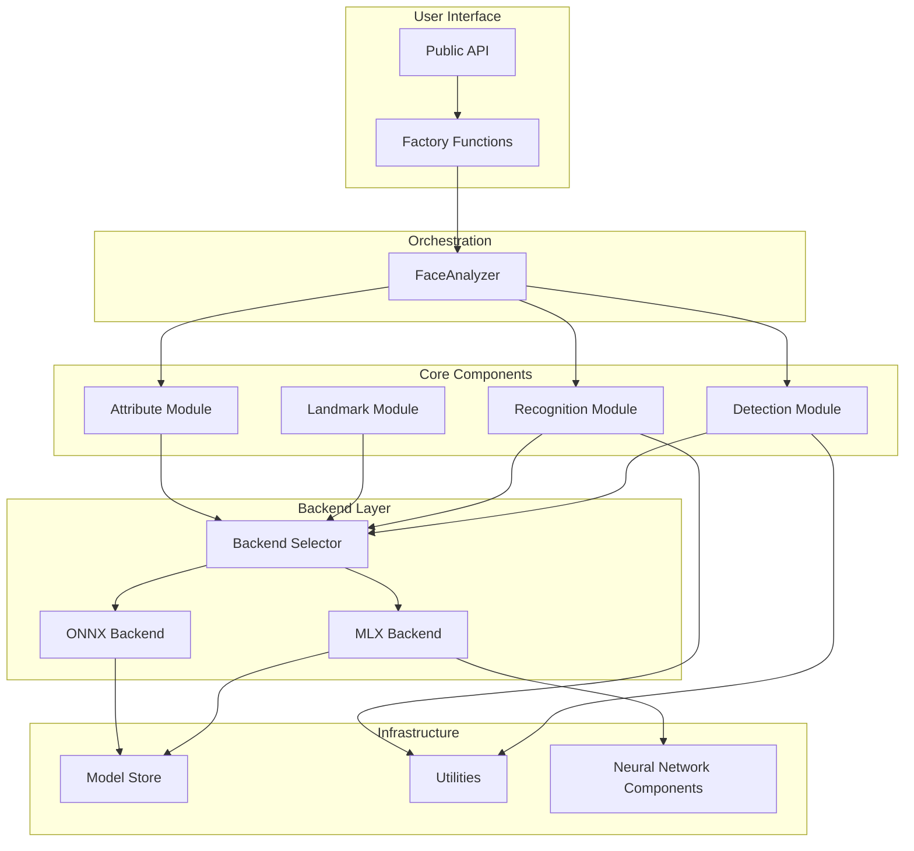

---

## Module Structure

```
uniface/
├── __init__.py                 # Public API exports
├── analyzer.py                 # FaceAnalyzer orchestrator
├── backend.py                  # Backend selection (MLX/ONNX)
├── face.py                     # Face dataclass
├── constants.py                # Model enums, URLs, SHA-256 hashes
│
├── detection/                  # Face Detection
│   ├── __init__.py            # Factory: create_detector, detect_faces
│   ├── base.py                # BaseDetector abstract class
│   ├── retinaface.py          # RetinaFace (ONNX)
│   ├── retinaface_mlx.py      # RetinaFace (MLX)
│   ├── scrfd.py               # SCRFD (ONNX)
│   ├── scrfd_mlx.py           # SCRFD (MLX)
│   ├── yolov5.py              # YOLOv5Face (ONNX)
│   └── yolov5_mlx.py          # YOLOv5Face (MLX)
│
├── recognition/               # Face Recognition
│   ├── __init__.py            # Factory: create_recognizer
│   ├── base.py                # BaseRecognizer (ONNX)
│   ├── base_mlx.py            # BaseRecognizerMLX
│   ├── models.py              # ArcFace, MobileFace, SphereFace
│   └── models_mlx.py          # MLX implementations
│
├── landmark/                  # Facial Landmarks
│   ├── __init__.py            # Factory: create_landmarker
│   ├── base.py                # BaseLandmarker
│   ├── models.py              # Landmark106 (ONNX)
│   └── models_mlx.py          # Landmark106MLX
│
├── attribute/                 # Face Attributes
│   ├── __init__.py            # Exports
│   ├── base.py                # Attribute base class
│   ├── age_gender.py          # AgeGender (ONNX)
│   ├── age_gender_mlx.py      # AgeGenderMLX
│   ├── emotion.py             # Emotion (PyTorch)
│   └── emotion_mlx.py         # EmotionMLX
│
├── nn/                        # Neural Network Building Blocks (MLX)
│   ├── __init__.py
│   ├── backbone.py            # MobileNetV1, MobileNetV2
│   ├── conv.py                # Convolution layers
│   ├── fpn.py                 # Feature Pyramid Network
│   └── head.py                # Detection heads
│
├── common.py                  # Shared utilities (anchors, NMS)
├── face_utils.py              # Face alignment, similarity
├── mlx_utils.py               # MLX utilities
├── onnx_utils.py              # ONNX utilities
├── model_store.py             # Model downloading/verification
├── log.py                     # Logging configuration
└── visualization.py           # Drawing utilities
```

---

## Class Hierarchies

### Detection Hierarchy

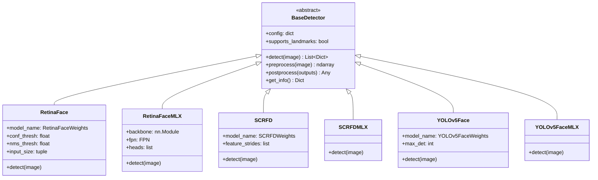

### Recognition Hierarchy

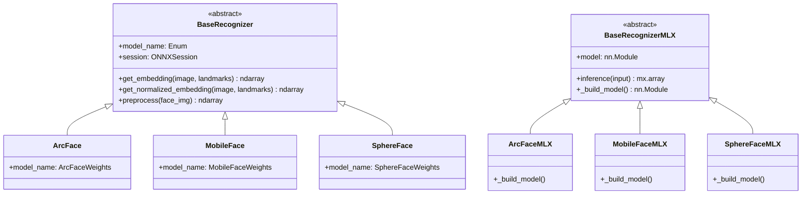

### Attribute Hierarchy

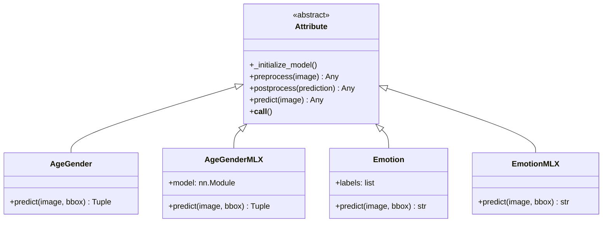

---

## Backend System

The backend system provides seamless switching between MLX and ONNX implementations.

### Backend Selection Flow

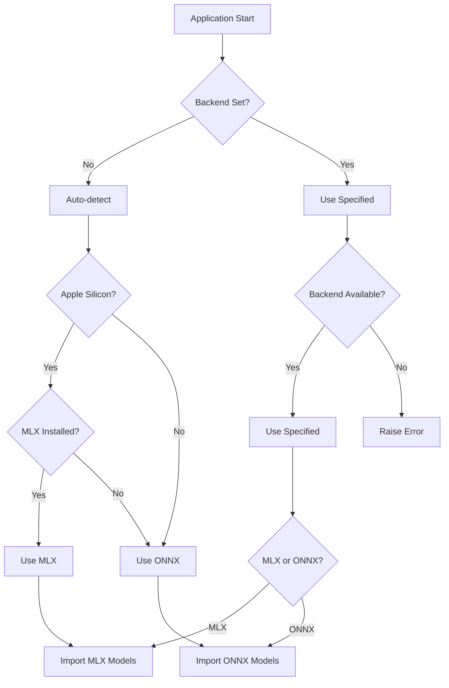

### Backend API

```python
from uniface.backend import Backend, set_backend, get_backend

# Auto-selection (default)
set_backend(Backend.AUTO)

# Force MLX (Apple Silicon)
set_backend(Backend.MLX)

# Force ONNX (cross-platform)
set_backend(Backend.ONNX)
```

---

## Data Flow

### Complete Analysis Pipeline

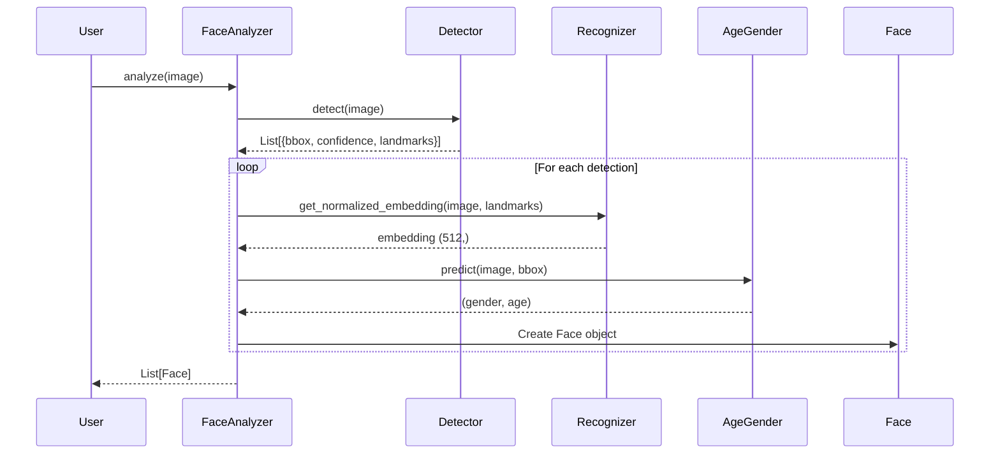

### Detection Pipeline (RetinaFace)

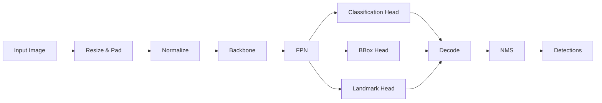

### Recognition Pipeline


---

## Model Weight Management

### Weight Download Flow

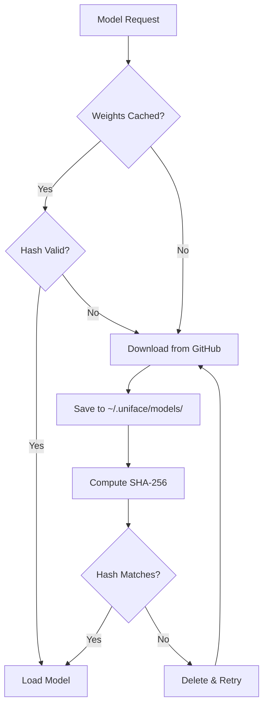

### Model Storage Structure

```
~/.uniface/models/
├── retinaface_mv2.onnx           # ONNX weights
├── retinaface_mnet_v2.safetensors # MLX weights
├── w600k_mbf.onnx                 # ArcFace ONNX
├── arcface_mnet.safetensors       # ArcFace MLX
├── genderage.onnx                 # Age/Gender
├── age_gender.safetensors         # Age/Gender MLX
└── ...
```

---

## Neural Network Components

### RetinaFace Architecture (MLX)

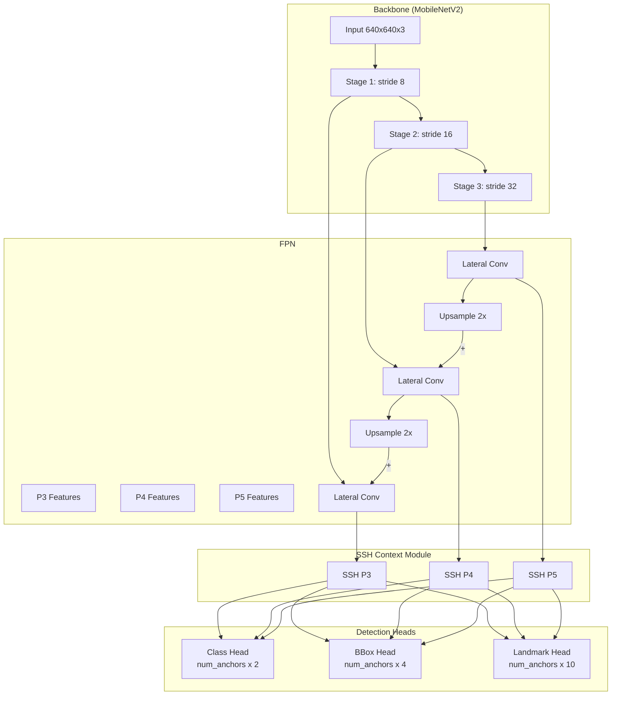

### Inverted Residual Block (MobileNetV2)

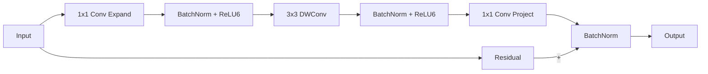

---

## Design Patterns

### 1. Factory Pattern

Factory functions abstract the creation of complex objects:

```python
# Detection factory
detector = create_detector('retinaface', conf_thresh=0.7)

# Recognition factory
recognizer = create_recognizer('arcface')

# Landmark factory
landmarker = create_landmarker('2d106det')
```

### 2. Strategy Pattern

Backend selection allows swapping implementations at runtime:

```python
# Same API, different backends
if use_mlx():
    from .retinaface_mlx import RetinaFaceMLX as RetinaFace
else:
    from .retinaface import RetinaFace
```

### 3. Template Method Pattern

Base classes define the algorithm structure:

```python
class BaseDetector(ABC):
    def detect(self, image):
        preprocessed = self.preprocess(image)  # Step 1
        outputs = self._inference(preprocessed)  # Step 2
        return self.postprocess(outputs)  # Step 3

    @abstractmethod
    def preprocess(self, image): pass

    @abstractmethod
    def postprocess(self, outputs): pass
```

### 4. Singleton Pattern (Caching)

Detector instances are cached for reuse:

```python
_detector_cache: Dict[str, BaseDetector] = {}

def detect_faces(image, method='retinaface', **kwargs):
    cache_key = f'{method}_{sorted(kwargs.items())}'
    if cache_key not in _detector_cache:
        _detector_cache[cache_key] = create_detector(method, **kwargs)
    return _detector_cache[cache_key].detect(image)
```

### 5. Dataclass Pattern

The `Face` class uses Python dataclasses for clean data representation:

```python
@dataclass
class Face:
    bbox: np.ndarray
    confidence: float
    landmarks: np.ndarray
    embedding: Optional[np.ndarray] = None
    age: Optional[int] = None
    gender: Optional[int] = None
```

---

## Hardware Acceleration

### ONNX Provider Selection

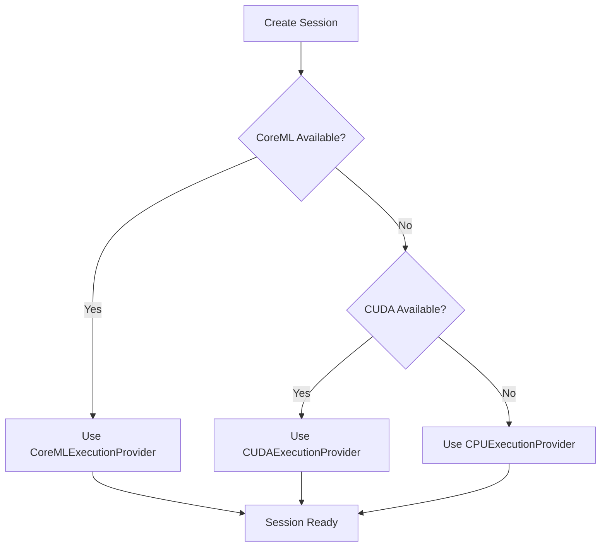

### MLX Device Selection

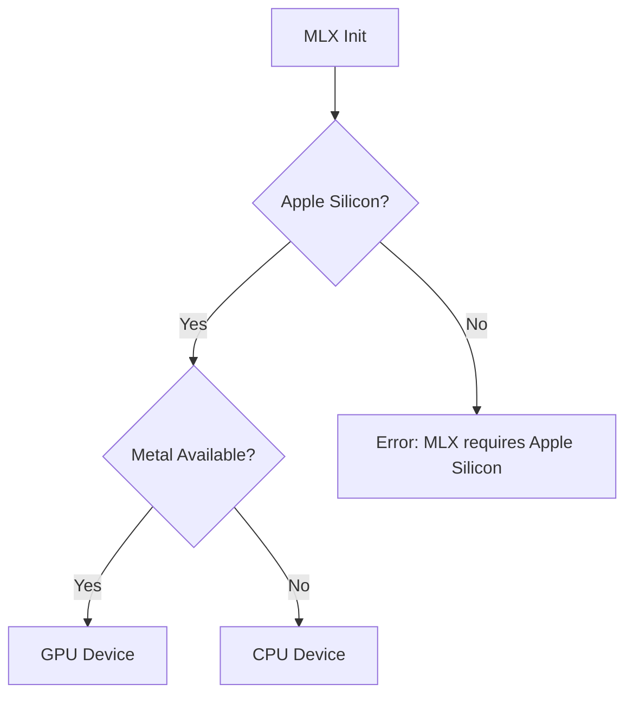

---

## Key Architectural Decisions

### 1. Dual Backend Support

**Decision:** Support both MLX and ONNX backends with automatic selection.

**Rationale:**
- MLX provides native Apple Silicon optimization (2-10x faster)
- ONNX ensures cross-platform compatibility
- Auto-selection provides best UX

### 2. Weight Verification

**Decision:** SHA-256 hash verification for all model downloads.

**Rationale:**
- Ensures model integrity
- Prevents corrupted downloads
- Security against tampering

### 3. Lazy Loading

**Decision:** Models are downloaded and loaded on first use.

**Rationale:**
- Faster startup time
- Reduced memory usage
- Only download what's needed

### 4. Unified API

**Decision:** Same API surface for both backends.

**Rationale:**
- Seamless backend switching
- Simplified testing
- Better maintainability

---

*Architecture documentation for MLX-UniFace v1.3.1*
