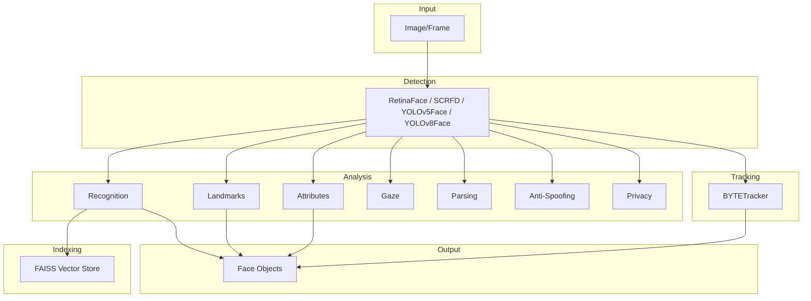

# Overview

UniFace is designed as a modular, production-ready face analysis library. This page explains the architecture and design principles.

---

## Architecture

UniFace follows a modular architecture where each face analysis task is handled by a dedicated module:



---

## Design Principles

### 1. ONNX-First

All models use ONNX Runtime for inference:

- **Cross-platform**: Same models work on macOS, Linux, Windows
- **Hardware acceleration**: Automatic selection of optimal provider
- **Production-ready**: No Python-only dependencies for inference

### 2. Minimal Dependencies

Core dependencies are kept minimal:

```
numpy         # Array operations
opencv-python # Image processing
onnxruntime   # Model inference
requests      # Model download
tqdm          # Progress bars
```

### 3. Simple API

Factory functions and direct instantiation:

```python
from uniface.detection import RetinaFace

detector = RetinaFace()

# Or via factory function
from uniface.detection import create_detector

detector = create_detector('retinaface')
```

### 4. Type Safety

Full type hints throughout:

```python
def detect(self, image: np.ndarray) -> list[Face]:
    ...
```

---

## Module Structure

```
uniface/
├── detection/      # Face detection (RetinaFace, SCRFD, YOLOv5Face, YOLOv8Face)
├── recognition/    # Face recognition (AdaFace, ArcFace, MobileFace, SphereFace)
├── tracking/       # Multi-object tracking (BYTETracker)
├── landmark/       # 106-point landmarks
├── attribute/      # Age, gender, emotion, race
├── parsing/        # Face semantic segmentation
├── gaze/           # Gaze estimation
├── spoofing/       # Anti-spoofing
├── privacy/        # Face anonymization
├── indexing/       # Vector indexing (FAISS)
├── types.py        # Dataclasses (Face, GazeResult, etc.)
├── constants.py    # Model weights and URLs
├── model_store.py  # Model download and caching
├── onnx_utils.py   # ONNX Runtime utilities
└── draw.py         # Drawing utilities
```

---

## Workflow

A typical face analysis workflow:

```python
import cv2
from uniface.attribute import AgeGender
from uniface.detection import RetinaFace
from uniface.recognition import ArcFace

# 1. Initialize models
detector = RetinaFace()
recognizer = ArcFace()
age_gender = AgeGender()

# 2. Load image
image = cv2.imread("photo.jpg")

# 3. Detect faces
faces = detector.detect(image)

# 4. Analyze each face
for face in faces:
    # Recognition embedding
    embedding = recognizer.get_normalized_embedding(image, face.landmarks)

    # Attributes
    attrs = age_gender.predict(image, face.bbox)

    print(f"Face: {attrs.sex}, {attrs.age} years")
```

---

## FaceAnalyzer

For convenience, `FaceAnalyzer` combines multiple modules:

```python
from uniface.analyzer import FaceAnalyzer
from uniface.attribute import AgeGender, FairFace
from uniface.detection import RetinaFace
from uniface.recognition import ArcFace

detector = RetinaFace()
recognizer = ArcFace()
age_gender = AgeGender()
fairface = FairFace()

analyzer = FaceAnalyzer(
    detector,
    recognizer=recognizer,
    age_gender=age_gender,
    fairface=fairface,
)

faces = analyzer.analyze(image)
for face in faces:
    print(f"Age: {face.age}, Gender: {face.sex}")
    print(f"Embedding: {face.embedding.shape}")
```

---

## Model Lifecycle

1. **First use**: Model is downloaded from GitHub releases
2. **Cached**: Stored in `~/.uniface/models/` (configurable via `set_cache_dir()` or `UNIFACE_CACHE_DIR`)
3. **Verified**: SHA-256 checksum validation
4. **Loaded**: ONNX Runtime session created
5. **Inference**: Hardware-accelerated execution

```python
# Models auto-download on first use
detector = RetinaFace()  # Downloads if not cached

# Optionally configure cache location
from uniface.model_store import get_cache_dir, set_cache_dir
set_cache_dir('/data/models')
print(get_cache_dir())  # /data/models

# Or manually pre-download
from uniface.model_store import verify_model_weights
from uniface.constants import RetinaFaceWeights

path = verify_model_weights(RetinaFaceWeights.MNET_V2)
```

---

## Next Steps

- [Inputs & Outputs](inputs-outputs.md) - Understand data types
- [Execution Providers](execution-providers.md) - Hardware acceleration
- [Detection Module](../modules/detection.md) - Start with face detection
- [Image Pipeline Recipe](../recipes/image-pipeline.md) - Complete workflow
